<a id="readme-top"></a>

<!-- PROJECT SHIELDS -->


<!-- PROJECT LOGO -->
<br />
<div align="center">
  <a href="https://github.com/DiabdataApp/diab-data-android">
    
  </a>

  <h3 align="center">Diab Data</h3>
  <p align="center">
  <a href="https://github.com/DiabdataApp/diab-data-android/releases">Releases</a> • <a href="https://app.diabdata.fr/">Website</a>
  </p>
  <p align="center">
    An android app that lets you keep track of all diabetes related information that you may need to communicate on a regular basis.
  </p>
  <br/>
</div>

<br/>

<!-- TABLE OF CONTENTS -->
<details>
  <summary>Table of Contents</summary>

- [About The Project](#about-the-project)
- [Features](#features)
- [Screenshots](#screenshots)
  - [Built With](#built-with)
- [Installation](#installation)
  - [Prerequisites](#prerequisites)
  - [Clone the repo](#clone-the-repo)
- [Project's architecture](#projects-architecture)
- [Contributing](#contributing)
- [Roadmap](#roadmap)
- [Contact](#contact)
</details>

<!-- ABOUT THE PROJECT -->

## About The Project

<!--  -->

This project was born from my habit of tracking my diabetes related information on a google sheets document which was a bit
annoying on the long run. This app aims to let users add important dates and add their medical results to the app in order to
have everything in the same place and easier to find and update.

## Features
<table>
  <thead>
    <tr>
      <th scope="col">Feature</th>
      <th scope="col">Description</th>
    </tr>
  </thead>
  <tbody>
    <tr>
      <th scope="row">Important dates</th>
      <td>Save important dates (First pump installation, etc...)</td>
    </tr>
    <tr>
      <th scope="row">Medical appointments</th>
      <td>Add your appointments and set up reminders</td>
    </tr>
    <tr>
      <th scope="row">Weight tracking</th>
      <td>Keep weights records and display graphs</td>
    </tr>
    <tr>
      <th scope="row">Hba1c tracking</th>
      <td>Keep hba1c records and display graphs</td>
    </tr>
    <tr>
      <th scope="row">Medication/Medical devices tracking</th>
      <td>Save your treatments and equipment and get alerted when they expire</td>
    </tr>
    <tr>
      <th scope="row">DataMatrix scanner</th>
      <td>Scan and add treatments and devices to your records by scanning their data matrix</td>
    </tr>
    <tr>
      <th scope="row">Widget</th>
      <td>Add the glance widget to your homescreen to keep an eye on relevant information in real time</td>
    </tr>
    <tr>
      <th scope="row">Wear Os</th>
      <td>Use complications to keep track of expiring devices, treatments or upcoming appointments</td>
    </tr>
    <tr>
      <th scope="row">Backup</th>
      <td>Export/import all of your data</td>
    </tr>
    <tr>
      <th scope="row">Cast data mode</th>
      <td>Update your data via the webapp companion or send a link to get restricted access to your latest information to your practicionner</td>
    </tr>
  </tbody>
</table>

## Screenshots

<details>
  <summary>Screenshots</summary>
  <table>
    <tr>
      <td>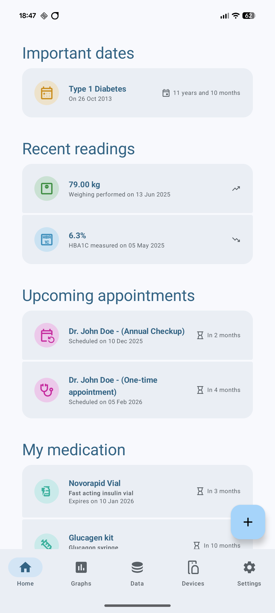</td>
      <td>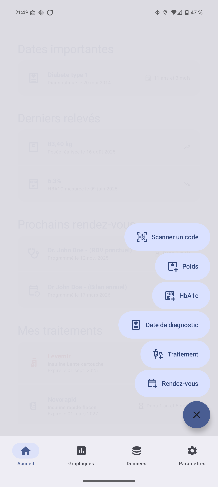</td>
      <td>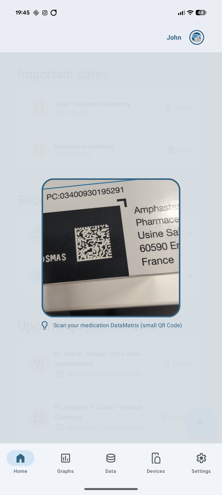</td>
      <td>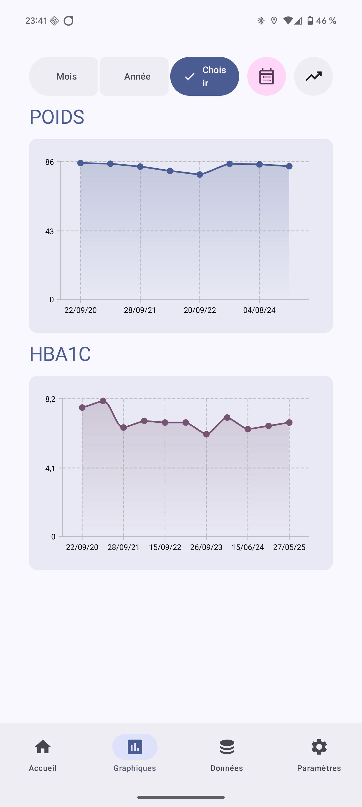</td>
      <td>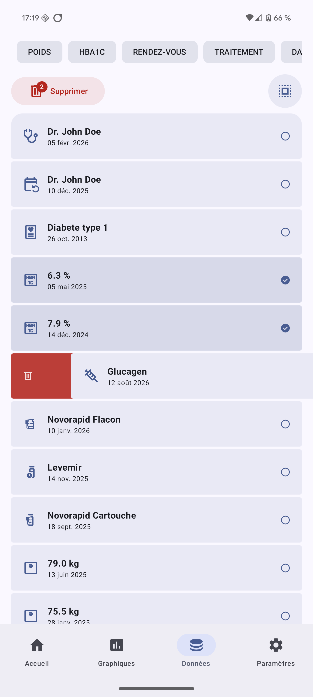</td>
      <td>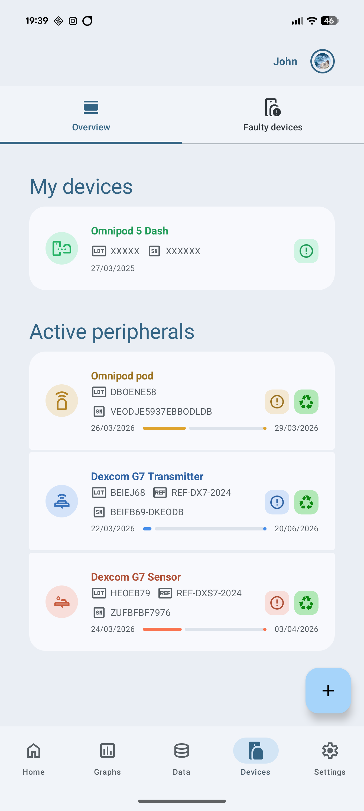</td>
    </tr>
    <tr>
      <td>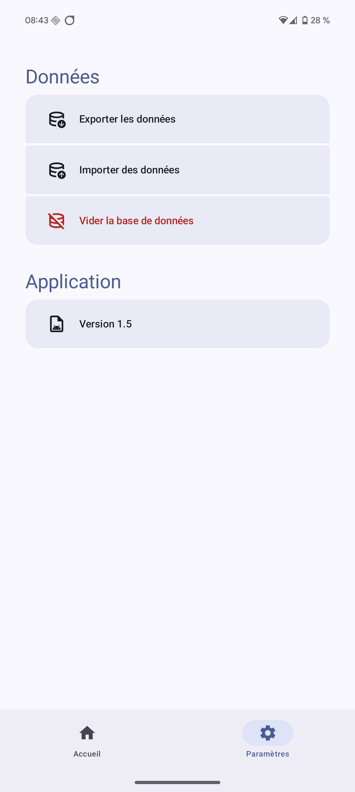</td>
      <td>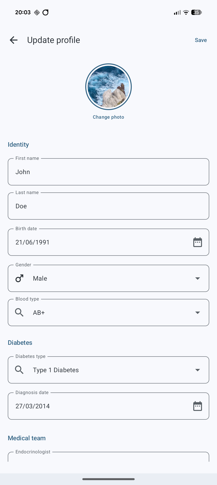</td>
      <td>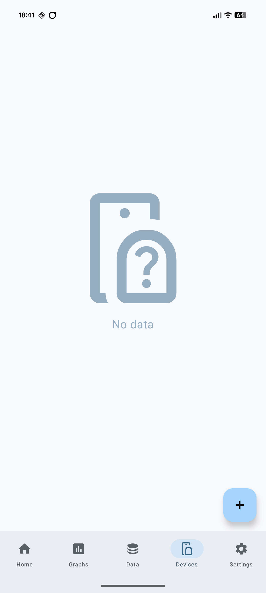</td>
      <td>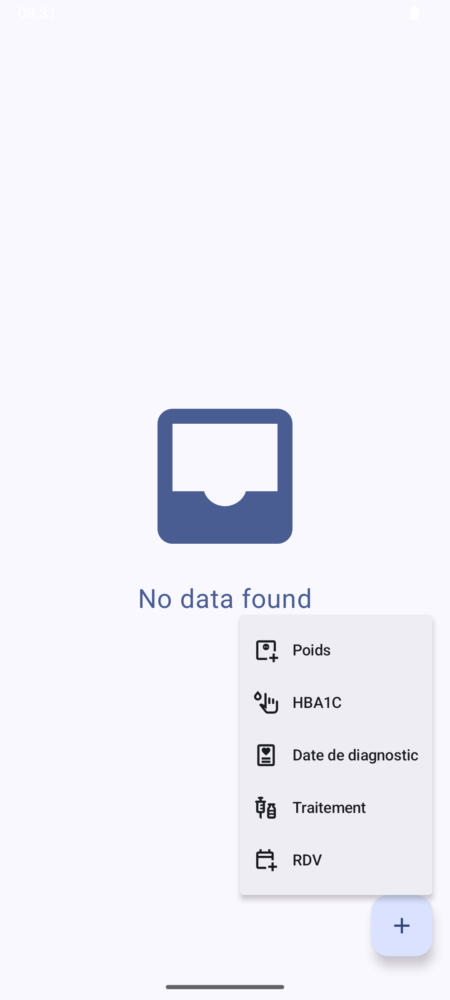</td>
      <td>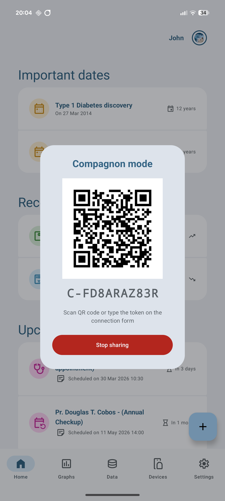</td>
    </tr>
  </table>
</details>

### Built With

This project is built using the following frameworks/libraries:

<div>

  [](https://kotlinlang.org/)
  [](https://developer.android.com/jetpack/compose/)
  [](https://developer.android.com/jetpack/androidx/releases/room)

</div>

<div>

  [](https://developer.android.com/studio/)
  [](https://fonts.google.com/icons?icon.size=24&icon.color=%235f6368&icon.query=date&icon.set=Material+Symbols&icon.style=Outlined)
  [](https://github.com/patrykandpatrick/vico)

</div>

<p align="right">(<a href="#readme-top">back to top</a>)</p>

<!-- INSTALLATION -->

## Installation

### Prerequisites

- Android Studio Ladybug (2024.3) or newer
- JDK 17+
- Android SDK with API 35 (compile) / API 26 (min)

### Clone the repo

Clone repository

```bash
git clone https://github.com/DiabdataApp/diab-data-android.git
```

#### Setting up your variables

Next rename the local.properties.sample file to local.properties and fill in the required fields:
```
sdk.dir=/path/to/your/sdk
RELAY_SERVER_URL=your.relay.url
RELEASE_STORE_FILE=KEYSTORE-PATH.jks
RELEASE_STORE_PASSWORD=KEYSTORE-PASSWORD
RELEASE_KEY_ALIAS=diabdata
RELEASE_KEY_PASSWORD=KEY-PASSWORD
```

You can then open the project in Android Studio.

<p align="right">(<a href="#readme-top">back to top</a>)</p>

## Project's architecture

This projects follows a feature based architectecture:

```
├── app/
├── shared/ # String resources, drawables and code shared between modules
├── wear/ # Wear Os Module
├── core/
│ ├── database/ # Room DB, DAOs, migrations
│ ├── model/ # Database model entities
│ ├── ui/ # Core UI components used accross the app
│ ├── utils/
│ └── notifications/ # Notification management
├── feature/
│ ├── appointments/ # Appointments management
│ ├── devices/ # Medical devices management
│ ├── casting/ # Data casting mode
│ ├── hba1c/ # Hba1c records management
│ ├── weight/ # Weight records management
│ ├── settings/ # Settings
│ └── dataMatrixScanner/ # Code scanner
└── widget/ # Glance widget
```

<p align="right">(<a href="#readme-top">back to top</a>)</p>

## Contributing

When contributing to the project, always start by creating a branch from the `dev` branch and once you are done with your contribution, push into remote `dev`.

1. Find a name for your branch. The naming convention is as follows:

- First letter of your first name, capitalized (e.g., `F`)

- Your last name, in uppercase (e.g., `COSSU`)

- A dash `-`

- A short, capitalized identifier for the feature (spaces replaced by underscores)

- **For example if Florian cossu is working on updating the database**

```
FCOSSU-Database_migration
```

2. Create your Feature Branch (`git checkout -b dev/FCOSSU-Database_migration`)
3. Commit your Changes (`git commit -m 'Add some new feature'`)
4. Push to the **`dev`** Branch (`git push origin/dev dev/FCOSSU-Database_migration`)

<p align="right">(<a href="#readme-top">back to top</a>)</p>

<!-- ROADMAP -->

## Roadmap

See the [open issues](https://github.com/DiabdataApp/diab-data-android/issues) for a full list of
proposed features (and known issues).

<p align="right">(<a href="#readme-top">back to top</a>)</p>

<!-- CONTACT -->

## Contact

Florian Cossu - [Linkedin](https://www.linkedin.com/in/florian-cossu/) - [Github](https://github.com/Florian-cossu)

Project
Link: [https://github.com/DiabdataApp/diab-data-android](https://github.com/DiabdataApp/diab-data-android)

<p align="right">(<a href="#readme-top">back to top</a>)</p>